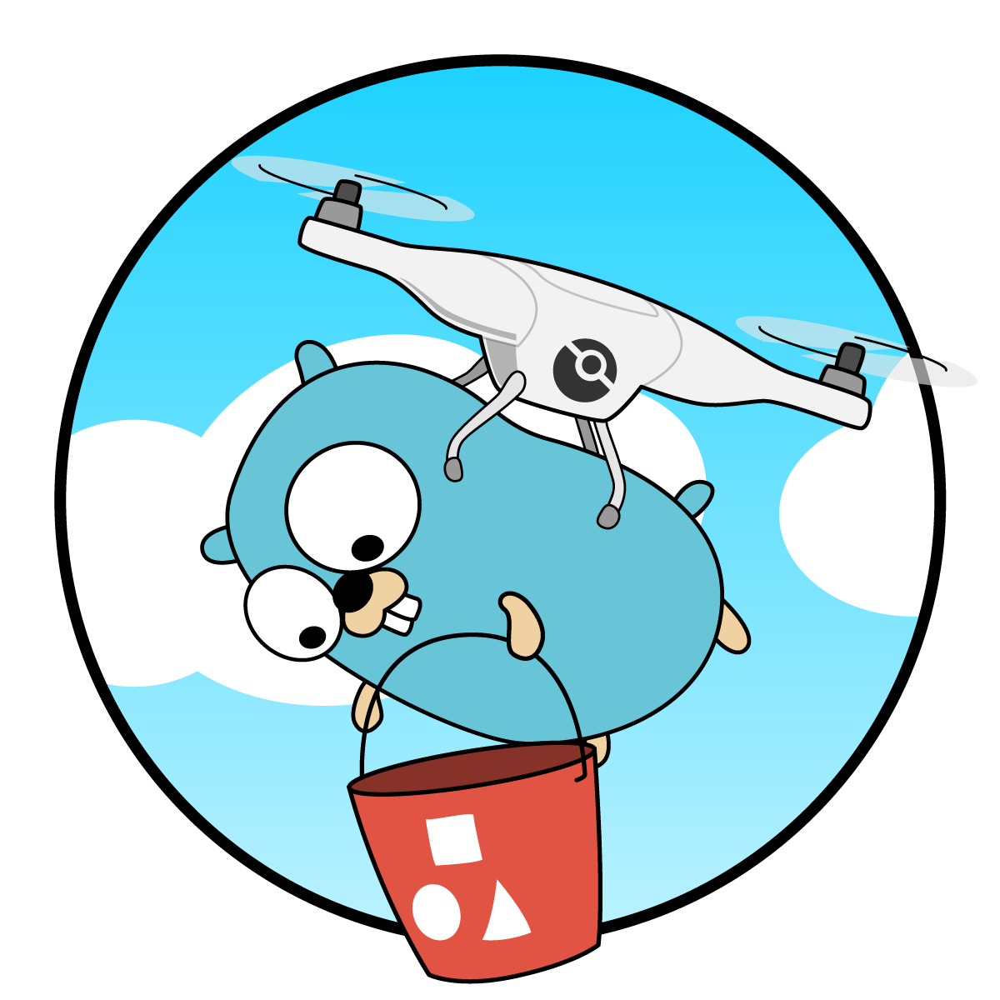
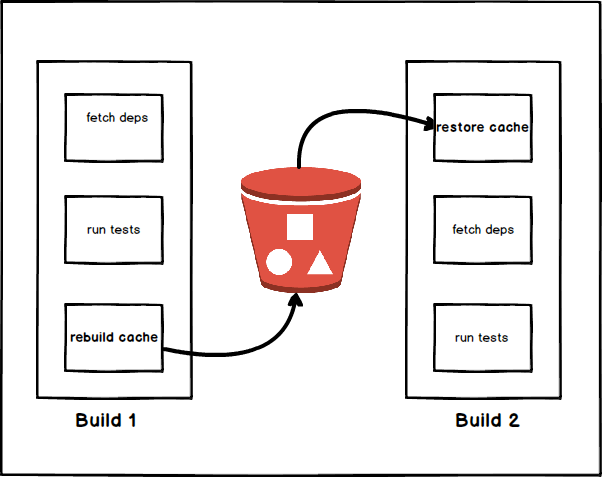

# drone-cache

[](https://github.com/meltwater/drone-cache/releases) [](https://github.com/meltwater/drone-cache/commits/master) [](https://cloud.drone.io/meltwater/drone-cache) [](http://godoc.org/github.com/meltwater/drone-cache) [](https://goreportcard.com/report/github.com/meltwater/drone-cache) [](https://codebeat.co/projects/github-com-meltwater-drone-cache-master) [](https://microbadger.com/images/meltwater/drone-cache) [](https://microbadger.com/images/meltwater/drone-cache)

<p align="center"></p>

A Drone plugin for caching current workspace files between builds to reduce your build times. `drone-cache` is a small CLI program, written in Go without any external OS dependencies (such as tar, etc).

With `drone-cache`, you can provide your **own cache key templates**, specify **archive format** (tar, tar.gz, etc) and you can use **an S3 bucket or a mounted volume** as storage for your cached files, even better you can implement **your own storage backend** to cover your use case.

For detailed usage information and a list of available options please take a look at [usage](#usage) and [examples](#example-usage-of-drone-cache). If you want to learn more about custom cache keys, see [cache key templates](docs/cache_key_templates.md).

If you want to learn more about the story behind `drone-cache`, you can read our blogpost [Making Drone Builds 10 Times Faster!](https://underthehood.meltwater.com/blog/2019/04/10/making-drone-builds-10-times-faster/)!

## How does it work

`drone-cache` stores mounted directories and files under a key at the specified backend (by default S3).

Use this plugin to cache data that makes your builds faster. In the case of a cache miss or zero cache restore it will fail silently in won't break your running pipeline.

The best example would be to use this with your package managers such as Mix, Bundler or Maven. After your initial download, you can build a cache and then you can restore that cache in your next build.

<p align="center"></p>

With restored dependencies from a cache, commands like `mix deps.get` will only need to download new dependencies, rather than re-download every package on each and every build.

## Example Usage of drone-cache

The following `.drone.yml` configuration show the most common use of drone-cache.

Note: These configs use drone 1.0 syntax. If you are using drone 0.8, check the examples in [docs/examples/drone-0.8.md](docs/examples/drone-0.8.md).

### Simple (Storing the cache in S3)

```yaml
kind: pipeline
name: default

steps:
  - name: restore-cache
    image: meltwater/drone-cache
    environment:
      AWS_ACCESS_KEY_ID:
        from_secret: aws_access_key_id
      AWS_SECRET_ACCESS_KEY:
        from_secret: aws_secret_access_key
    pull: true
    settings:
      restore: true
      cache_key: {{ .Commit.Branch }}-{{ checksum "go.mod" }} # default if ommitted is {{ .Commit.Branch }}
      bucket: drone-cache-bucket
      region: eu-west-1
      mount:
        - 'vendor'

  - name: build
    image: golang:1.11-alpine
    pull: true
    commands:
      - apk add --update make git
      - make drone-cache

  - name: rebuild-cache
    image: meltwater/drone-cache
    pull: true
    environment:
      AWS_ACCESS_KEY_ID:
        from_secret: aws_access_key_id
      AWS_SECRET_ACCESS_KEY:
        from_secret: aws_secret_access_key
    settings:
      rebuild: true
      cache_key: {{ .Commit.Branch }}-{{ checksum "go.mod" }} # default if ommitted is {{ .Commit.Branch }}
      bucket: drone-cache-bucket
      region: eu-west-1
      mount:
        - 'vendor'

```

### Other Examples

- examples for Drone 0.8, see [docs/examples/drone-0.8.md](docs/examples/drone-0.8.md)
- examples for Drone 1.0, see [docs/examples/drone-1.0.md](docs/examples/drone-1.0.md)

## Usage

### Using executable (with CLI args)

```console
NAME:
   Drone cache plugin - Drone cache plugin

USAGE:
   drone-cache [global options] command [command options] [arguments...]

VERSION:
   1.0.4

COMMANDS:
     help, h  Shows a list of commands or help for one command

GLOBAL OPTIONS:
   --repo.fullname value, --rf value           repository full name [$DRONE_REPO]
   --repo.namespace value, --rns value         repository namespace [$DRONE_REPO_NAMESPACE]
   --repo.owner value, --ro value              repository owner (for Drone version < 1.0) [$DRONE_REPO_OWNER]
   --repo.name value, --rn value               repository name [$DRONE_REPO_NAME]
   --repo.link value, --rl value               repository link [$DRONE_REPO_LINK]
   --repo.avatar value, --ra value             repository avatar [$DRONE_REPO_AVATAR]
   --repo.branch value, --rb value             repository default branch [$DRONE_REPO_BRANCH]
   --repo.private, --rp                        repository is private [$DRONE_REPO_PRIVATE]
   --repo.trusted, --rt                        repository is trusted [$DRONE_REPO_TRUSTED]
   --remote.url value, --remu value            git remote url [$DRONE_REMOTE_URL]
   --commit.sha value, --cs value              git commit sha [$DRONE_COMMIT_SHA]
   --commit.ref value, --cr value              git commit ref (default: "refs/heads/master") [$DRONE_COMMIT_REF]
   --commit.branch value, --cb value           git commit branch (default: "master") [$DRONE_COMMIT_BRANCH]
   --commit.message value, --cm value          git commit message [$DRONE_COMMIT_MESSAGE]
   --commit.link value, --cl value             git commit link [$DRONE_COMMIT_LINK]
   --commit.author.name value, --an value      git author name [$DRONE_COMMIT_AUTHOR]
   --commit.author.email value, --ae value     git author email [$DRONE_COMMIT_AUTHOR_EMAIL]
   --commit.author.avatar value, --aa value    git author avatar [$DRONE_COMMIT_AUTHOR_AVATAR]
   --build.event value, --be value             build event (default: "push") [$DRONE_BUILD_EVENT]
   --build.number value, --bn value            build number (default: 0) [$DRONE_BUILD_NUMBER]
   --build.created value, --bc value           build created (default: 0) [$DRONE_BUILD_CREATED]
   --build.started value, --bs value           build started (default: 0) [$DRONE_BUILD_STARTED]
   --build.finished value, --bf value          build finished (default: 0) [$DRONE_BUILD_FINISHED]
   --build.status value, --bstat value         build status (default: "success") [$DRONE_BUILD_STATUS]
   --build.link value, --bl value              build link [$DRONE_BUILD_LINK]
   --build.deploy value, --db value            build deployment target [$DRONE_DEPLOY_TO]
   --yaml.verified, --yv                       build yaml is verified [$DRONE_YAML_VERIFIED]
   --yaml.signed, --ys                         build yaml is signed [$DRONE_YAML_SIGNED]
   --prev.build.number value, --pbn value      previous build number (default: 0) [$DRONE_PREV_BUILD_NUMBER]
   --prev.build.status value, --pbst value     previous build status [$DRONE_PREV_BUILD_STATUS]
   --prev.commit.sha value, --pcs value        previous build sha [$DRONE_PREV_COMMIT_SHA]
   --backend value, -b value                   cache backend to use in plugin (s3, filesystem) (default: "s3") [$PLUGIN_BACKEND]
   --mount value, -m value                     cache directories, an array of folders to cache [$PLUGIN_MOUNT]
   --rebuild, --reb                            rebuild the cache directories [$PLUGIN_REBUILD]
   --restore, --res                            restore the cache directories [$PLUGIN_RESTORE]
   --cache-key value, --chk value              cache key to use for the cache directories [$PLUGIN_CACHE_KEY]
   --archive-format value, --arcfmt value      archive format to use to store the cache directories (tar, gzip) (default: "tar") [$PLUGIN_ARCHIVE_FORMAT]
   --skip-symlinks, --ss                       skip symbolic links in archive [$PLUGIN_SKIP_SYMLINKS, $ SKIP_SYMLINKS]
   --debug, -d                                 debug [$PLUGIN_DEBUG, $ DEBUG]
   --filesystem-cache-root value, --fcr value  local filesystem root directory for the filesystem cache (default: "/tmp/cache") [$PLUGIN_FILESYSTEM_CACHE_ROOT, $ FILESYSTEM_CACHE_ROOT]
   --endpoint value, -e value                  endpoint for the s3 connection [$PLUGIN_ENDPOINT, $S3_ENDPOINT]
   --access-key value, --akey value            AWS access key [$PLUGIN_ACCESS_KEY, $AWS_ACCESS_KEY_ID, $CACHE_AWS_ACCESS_KEY_ID]
   --secret-key value, --skey value            AWS secret key [$PLUGIN_SECRET_KEY, $AWS_SECRET_ACCESS_KEY, $CACHE_AWS_SECRET_ACCESS_KEY]
   --bucket value, --bckt value                AWS bucket name [$PLUGIN_BUCKET, $S3_BUCKET]
   --region value, --reg value                 AWS bucket region. (us-east-1, eu-west-1, ...) [$PLUGIN_REGION, $S3_REGION]
   --path-style, --ps                          use path style for bucket paths. (true for minio, false for aws) [$PLUGIN_PATH_STYLE]
   --acl value                                 upload files with acl (private, public-read, ...) (default: "private") [$PLUGIN_ACL]
   --encryption value, --enc value             server-side encryption algorithm, defaults to none. (AES256, aws:kms) [$PLUGIN_ENCRYPTION]
   --help, -h                                  show help
   --version, -v                               print the version
```

### Using Docker (with Environment variables)

```bash
$ docker run --rm \
      -v "$(pwd)":/app \
      -e DRONE_REPO=octocat/hello-world \
      -e DRONE_REPO_BRANCH=master \
      -e DRONE_COMMIT_BRANCH=master \
      -e PLUGIN_MOUNT=/app/node_modules \
      -e PLUGIN_RESTORE=false \
      -e PLUGIN_REBUILD=true \
      -e PLUGIN_BUCKET=<bucket> \
      -e AWS_ACCESS_KEY_ID=<token> \
      -e AWS_SECRET_ACCESS_KEY=<secret> \
      meltwater/drone-cache
```

## Development

### Local set-up

```console
$ ./scripts/setup_dev_environment.sh
```

### Tests

```console
$ ./test
```

OR

```console
$ docker-compose up -d
$ go test ./..
```

### Build Binary

Build the binary with the following commands:

```console
$ go build .
```

### Build Docker image

Build the docker image with the following commands:

```console
$ make docker-build
```

## Releases

Release management handled by CI pipeline. When you create a tag on `master` branch, CI handles the rest.

You can find released artifacts (binaries, code, archives) under [releases](https://github.com/meltwater/drone-cache/releases).

You can find released images at [DockerHub](https://hub.docker.com/r/meltwater/drone-cache/tags).

**PLEASE DO NOT INTRODUCE BREAKING CHANGES**

> Keep in mind that users usually use the image tagged with `latest` in their pipeline, please make sure you do not interfere with their working workflow.

## Versioning

We use [SemVer](http://semver.org/) for versioning. For the versions available, see the [tags on this repository](https://github.com/meltwater/drone-cache/tags).

## Authors and Acknowledgement

- [@dim](https://github.com/dim) - Thanks for [original work](https://github.com/bsm/drone-s3-cache)!
- [@kakkoyun](https://github.com/kakkoyun)
- [@salimane](https://github.com/salimane)
- [@AdamGlazerMW](https://github.com/AdamGlazerMW) - Special thanks to Adam for the amazing artwork!

Also see the list of [all contributors](https://github.com/meltwater/drone-cache/graphs/contributors).

### Inspiration

- [github.com/bsm/drone-s3-cache](https://github.com/bsm/drone-s3-cache) (original work)
- [github.com/Drillster/drone-volume-cache](https://github.com/Drillster/drone-volume-cache)

## Contributing

Please read [CONTRIBUTING.md](CONTRIBUTING.md) to understand how to submit pull requests to us, and also see our [code of conduct](CODE_OF_CONDUCT.md).

## Future work

We keep all ideas for new features and bug reports in [github.com/meltwater/drone-cache/issues](https://github.com/meltwater/drone-cache/issues).

One bigger area of future investment is to build a couple of [new storage backends](https://github.com/meltwater/drone-cache/labels/storage-backend) for caching the workspace files.

## License and Copyright

This project is licensed under the [Apache License 2.0](LICENSE).
